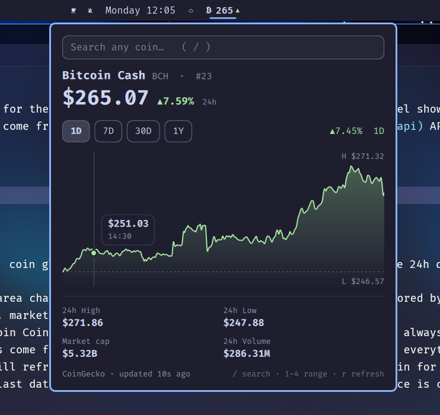

# BCH Crypto Panel

A compact Bitcoin Cash price pill for the [Omarchy](https://omarchy.org) bar, with a popup panel showing a live chart, market stats and search for any other coin. Prices come from the free [CoinGecko](https://www.coingecko.com/en/api) API — no API key needed.



## Features

- **Minimal bar pill** — `₿ 268▲`: coin glyph, rounded USD price, and a green/red arrow for the 24h direction. Hover for the exact price and 24h change.
- **Chart** — 1D / 7D / 30D / 1Y area chart with a hover crosshair and price/time tooltip. Colored by the move over the selected range.
- **Market stats** — 24h high/low, market cap with rank, and 24h volume.
- **Coin search** — look up any coin CoinGecko lists. It's a temporary view: closing the panel always returns to BCH.
- **Theme aware** — up/down colors come from your current Omarchy theme's `green` / `red`, and everything else follows the shell palette.
- **Polite with the API** — see [API usage](#api-usage). The last price is cached on disk so the pill has a value right after login.

## Install

```bash
omarchy plugin add https://github.com/fran-dv/bch-crypto-panel.git
```

You'll be asked to review, enable and place it. To do it non-interactively:

```bash
omarchy plugin add https://github.com/fran-dv/bch-crypto-panel.git --enable --yes
```

Move it anywhere in the bar, e.g. right after the weather pill:

```bash
omarchy bar move bch-crypto-panel --after omarchy.weather
```

Update or remove:

```bash
omarchy plugin update bch-crypto-panel
omarchy plugin remove bch-crypto-panel
```

## Usage

| Action               | Result                                    |
| -------------------- | ----------------------------------------- |
| Left-click pill      | Toggle panel                              |
| Middle-click pill    | Refresh now                               |
| Hover pill           | Exact price and 24h change                |
| `/` or `s`           | Focus search (↑/↓ + Enter to pick a coin) |
| `1`–`4` or `h` / `l` | Switch chart range                        |
| `r`                  | Refresh                                   |
| `Esc`                | Back to BCH, then close                   |
| `Tab`                | Move to the next bar panel                |

### Optional keybinding

Add to `~/.config/hypr/bindings.lua`:

```lua
o.bind("SUPER + ALT + C", "Crypto prices", "omarchy-shell shell toggle bch-crypto-panel")
```

## Notes

- Requires `curl` and a Nerd Font for the `₿` glyph (both ship with Omarchy).

## API usage

CoinGecko's keyless tier is rate-limited per IP (roughly 5–30 calls/min), so every request goes through a shared gate:

- **One request per window, however often you open the panel.** Prices are reused for 30s after a manual refresh (opening the panel, `r`, middle-click) and refreshed in the background once they're about a minute old. Charts are reused for 1 min (1D) or 5 min (longer ranges), and 30s on a manual refresh. Search results are cached per query for 10 min.
- **Multi-monitor safe.** The bar exists once per monitor, but all instances share one cache, one in-flight request per resource, and one backoff state, so extra monitors add no extra requests.
- **Real backoff.** A 429, 5xx or network failure closes the gate for 60s, then 120s, then 240s, for *every* request path including manual refresh. The last data stays on screen and the footer shows the retry countdown.

## Development

```bash
node --test tests/   # request gate, caches, parsing, formatting
```

After editing QML, run `omarchy restart shell` to load the changes.

## Files

| File             | Purpose                                       |
| ---------------- | --------------------------------------------- |
| `manifest.json`  | Plugin metadata and entry point               |
| `BarWidget.qml`  | Bar pill                                      |
| `Panel.qml`      | Popup UI and request orchestration            |
| `Shared.js`      | Caches, in-flight dedupe and backoff shared by all instances |
| `Request.qml`    | One curl request returning (status, body)     |
| `PriceChart.qml` | Canvas area chart with hover crosshair        |
| `Model.js`       | API URLs, response parsing, number formatting |

## License

MIT
